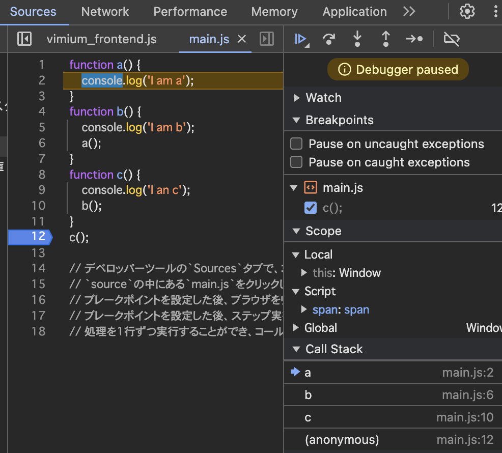

# コールスタック

## コールスタックとは

コールスタックは、JavaScriptエンジンがプログラムの実行状態を追跡するために使用するデータ構造です。
関数呼び出しの順序と各関数の実行コンテキストを管理します。

## 主な特徴

1. **LIFO（Last In, First Out）構造**: 最後に追加された項目が最初に取り出されます。
2. **同期的**: JavaScriptは基本的に単一スレッドで動作し、一度に1つの関数しか実行できません。
3. **一時的**: 関数の実行が完了すると、その関数のコンテキストはスタックから削除されます。

## コールスタックの動作

1. スクリプトの実行開始時、グローバル実行コンテキストがスタックに追加されます。
2. 関数が呼び出されると、その関数の実行コンテキストがスタックの一番上に追加されます。
3. 関数の実行が完了すると、そのコンテキストはスタックから削除されます。
4. プログラムの実行が終了すると、グローバル実行コンテキストもスタックから削除されます。

## コード例と解説

以下の例でコールスタックの動作を見てみましょう：

```javascript
function multiply(x, y) {
    return x * y;
}

function square(x) {
    return multiply(x, x);
}

function printSquare(x) {
    var s = square(x);
    console.log(s);
}

printSquare(5);
```

### コールスタックの変化

1. グローバル実行コンテキストが作成されスタックに追加
┌─────────────────────┐
│ Global Execution    │
│ Context             │
└─────────────────────┘
2. printSquare(5) 呼び出し → printSquareの実行コンテキストがスタックに追加
┌─────────────────────┐
│ printSquare         │
├─────────────────────┤
│ Global Execution    │
│ Context             │
└─────────────────────┘
3. square(x) 呼び出し → squareの実行コンテキストがスタックに追加
┌─────────────────────┐
│ square              │
├─────────────────────┤
│ printSquare         │
├─────────────────────┤
│ Global Execution    │
│ Context             │
└─────────────────────┘
4. multiply(x, x) 呼び出し → multiplyの実行コンテキストがスタックに追加
┌─────────────────────┐
│ multiply            │
├─────────────────────┤
│ square              │
├─────────────────────┤
│ printSquare         │
├─────────────────────┤
│ Global Execution    │
│ Context             │
└─────────────────────┘
5. multiply関数完了 → そのコンテキストがスタックから削除
┌─────────────────────┐
│ square              │
├─────────────────────┤
│ printSquare         │
├─────────────────────┤
│ Global Execution    │
│ Context             │
└─────────────────────┘
6. square関数完了 → そのコンテキストがスタックから削除
┌─────────────────────┐
│ printSquare         │
├─────────────────────┤
│ Global Execution    │
│ Context             │
└─────────────────────┘
7. console.log(s) 実行
8. printSquare関数完了 → そのコンテキストがスタックから削除
┌─────────────────────┐
│ Global Execution    │
│ Context             │
└─────────────────────┘
9. プログラム終了 → グローバル実行コンテキストがスタックから削除
┌─────────────────────┐
│
└─────────────────────┘

### デベロッパーツールで動作確認

デベロッパーツールの`Sources`タブで、コールスタックを確認することができる。
